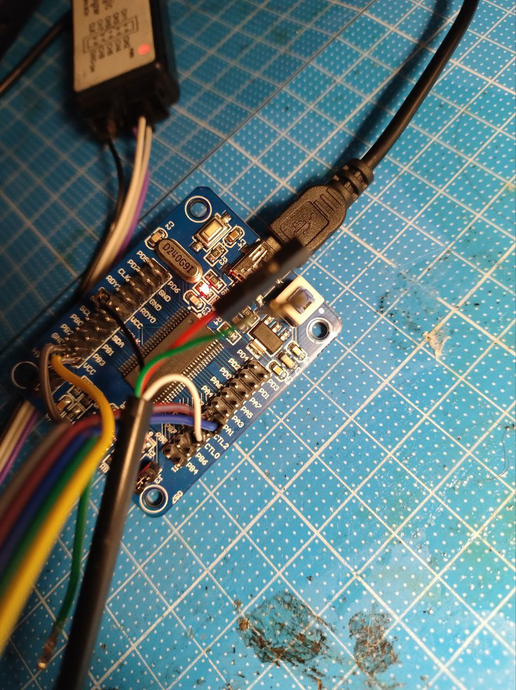

# CY7C68013 I2C-Tiny-USB firmware

## Brief 

This is firmware to make from cy7c68013 a Linux I2C adapter, which is use, very simple and available in every kernel, driver I2C-Tiny-USB.

In original firmware has been used AVR ICS instead of Cypress FX2 chips, and could be found at <a href="https://github.com/harbaum/I2C-Tiny-USB">https://github.com/harbaum/I2C-Tiny-USB</a>  (<a href ="https://www.kreativitaet-trifft-technik.de/project/i2c-tiny-usb.html">https://www.kreativitaet-trifft-technik.de/project/i2c-tiny-usb.html</a>)

## How to build

1. Install required packages
   1. `apt install sdcc i2c-tools python3-libusb1`
   2. `python3 -m pip install fx2`
2. Clone recursively this repo
   1. `git clone --recurse-submodules https://github.com/intx82/fx2-i2c-tiny-usb`
3. Build original (open source <a href="https://github.com/whitequark/libfx2.git">https://github.com/whitequark/libfx2.git</a>) FX2 SDK
   1. `make -C libfx2/firmware`
4. Attach cy7c68013 board and build and load into RAM this firmware
   1. `make -C src load`
   2. (optional) If needed to use it standalone -  could be used: `python3 -m fx2.fx2tool -S libfx2/firmware/boot-cypress/boot-cypress.ihex program -f src/i2c-tiny-usb.ihex` (be sure that you took off J4)
5. Use I2C on Linux - more details in Linux kernel docs (<a href="https://www.kernel.org/doc/Documentation/i2c/">https://www.kernel.org/doc/Documentation/i2c/</a>)
   1. As simple example, could be used utilities from i2c-tools: `sudo i2cdump -y -r 0-16 7 0x76 b` (reads first 16 registers from device with 0x76 address)

## Hardware

Right now, I2C pins are mapped to:
* SDA - PA2
* SCL - PA1

I2C pins could be remapped in [src/softi2c.c:13]

This firmware is using 'Software I2C', so speed is not as lightning, and equals near 70khz

## Board

Board could be found on AliExpress: https://aliexpi.com/DNc2